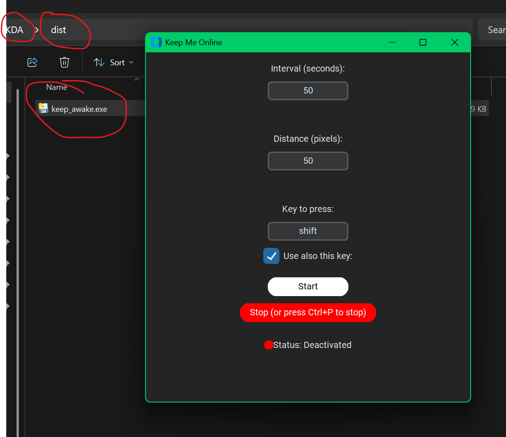

# 🚀 Keep Me Online 🟢

## 👀 Overview
**Keep Me Online** is a Python-based UI application that prevents online inactivity detection by simulating user input. The tool can periodically move the mouse cursor or send a keyboard input (such as the **Shift** key) to keep the session active.

The app is available as an executable (`.exe`), ready to use without installation.



---

## 🎯 Features
- **Customizable Activity Simulation:**
  - Set the mouse movement distance (default: **50 px**).
  - Choose the interval between actions (default: **50 seconds**).
  - Select a keyboard input to simulate (default: **Shift**).
- **Easy to Use:**
  - Press **Start** to activate Keep Me Online.
  - Press **Stop** to end the process.
- **Status Indicator:**
  - 🟢 **Green** when active.
  - 🔴 **Red** when inactive.
- **Emergency Stop:**
  - Press **Ctrl + P** to terminate immediately.

---

## 🛠️ For Developers
Want to modify or improve the project? Here’s how to set up your development environment!

### 📌 Prerequisites
- Python 3.x
- Required libraries: `pyautogui`, `tkinter`

### ⚙️ Setup
1. Clone the repository:
   ```sh
   git clone https://github.com/yourusername/keep-me-online.git
   cd keep-me-online
   ```
2. Install dependencies:
   ```sh
   pip install -r requirements.txt
   ```
3. Run the application:
   ```sh
   python keep_me_online.py
   ```

---

## 🖥️ How to Use?
1. Launch the executable or run the script.
2. Configure movement distance, loop interval, and input key.
3. Click **Start** to begin activity simulation.
4. Click **Stop** to halt the process.
5. Use **Ctrl + P** for an **emergency stop**.
---

## 🚀 Contributions & Support  

Found a bug? Have a feature suggestion? Open an **Issue** or a **Pull Request** on GitHub! 🎉  

💬 For any questions or support, feel free to reach out! 😊  

---

## 💬 Join Our Community!  

Need help or want to learn more about what I do with my experience in **game development** and **3D modeling**?  
Join our **Discord community** for support, discussions, and exclusive tutorials! 🎮🔥  

[](https://discord.com/invite/8GBkm252cS)  


---

## ⚠️ Disclaimer
This tool is intended for **ethical use only**. The author **is not responsible** for any misuse or consequences arising from its application.

---

## 📜 License
[MIT License](LICENSE)

---

### 🛠️ Created with ❤️ by San Liuk
